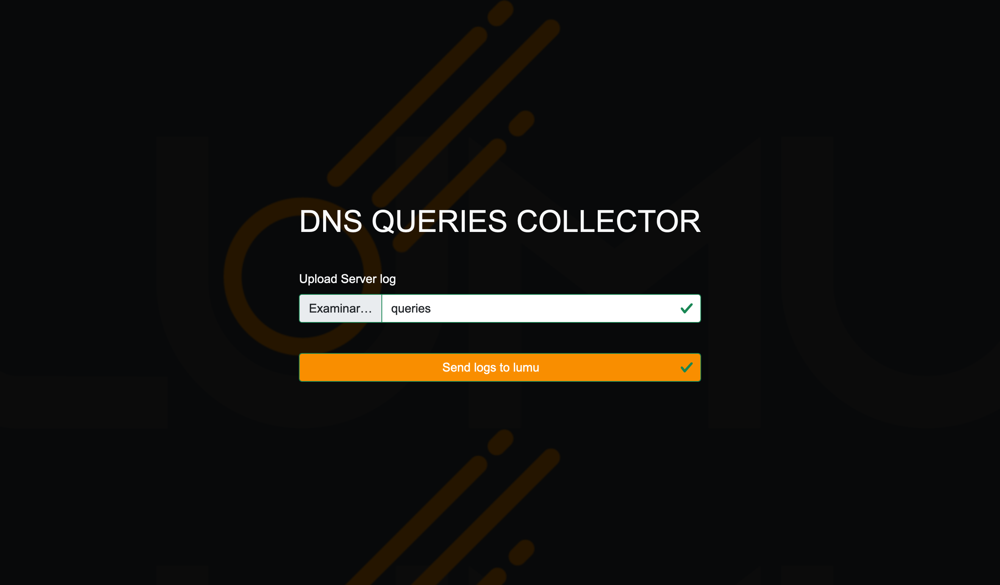
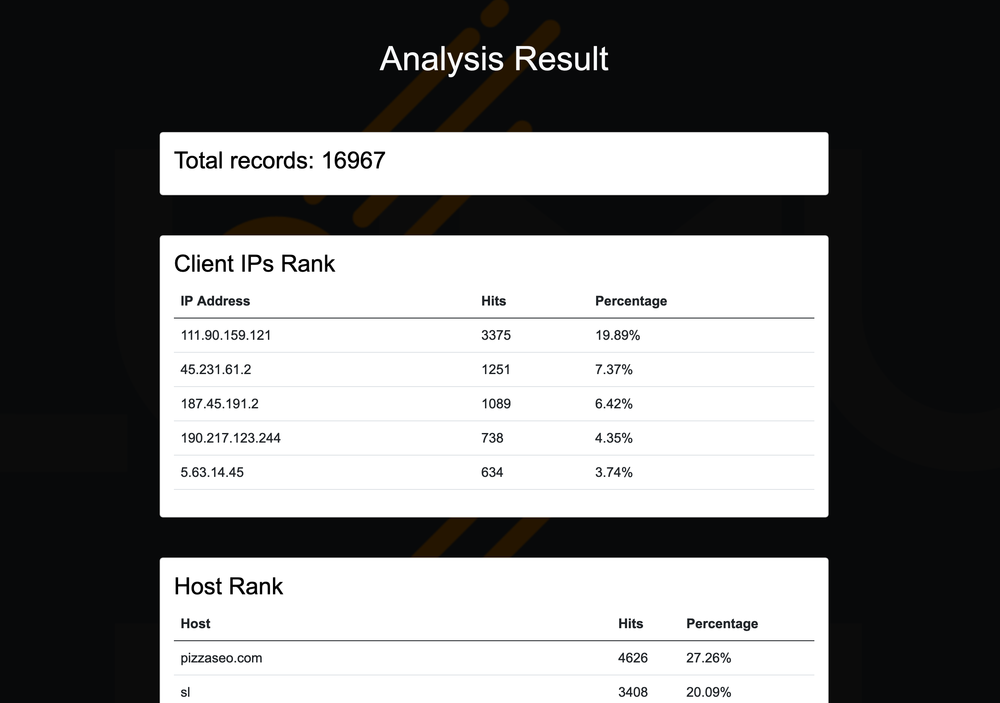
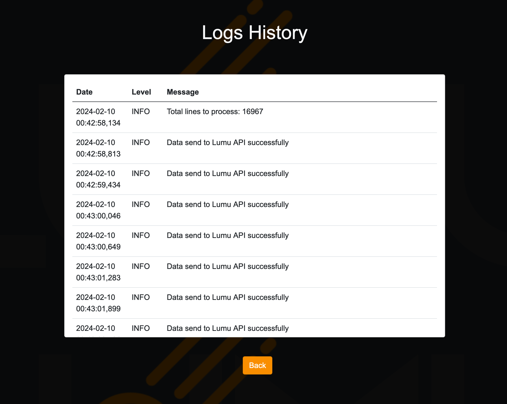
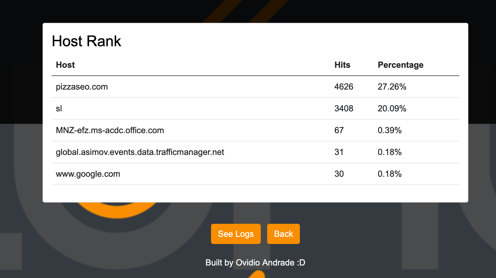

# DNS Queries Collector

This Flask application processes DNS log files, sending the data to an external LUMU API and displaying statistics about the most frequent IP addresses and hosts.

## Prerequisites

* Docker
* Docker Compose

Ensure Docker and Docker Compose are installed on your system. If not, please refer to the official documentation for [Docker](https://docs.docker.com/engine/install/) and [Docker Compose](https://docs.docker.com/compose/install/) installation instructions or [Docker Desktop](https://docs.docker.com/desktop/install/windows-install/)

## Project Structure
```bash
.
├── app
│   ├── Dockerfile
│   ├── app.py

│   ├── .env
│   ├── docker-compose.yml
│   ├── logs
│   │   ├── lumu.log
│   │   └── manager.py
│   ├── requirements.txt
│   ├── static
│   │   ├── lumu_logo.png
│   │   └── style.css
│   ├── templates
│   │   ├── index.html
│   │   ├── logs.html
│   │   └── stats.html
│   └── utils
│       └── helper.py
└── README.md
```


## Setup & Running

1. **Clone the repository**:

```bash
git clone [repository URL]
cd [repository directory]
```


2. **Build and run the Docker Container**

Ensure you're in the root directory of the project where `docker-compose.yml` is located, then:

```bash
docker-compose up --build
```


3. **Access the Application** :
   Open your web browser and go to `http://localhost:8043` to access the DNS Queries Collector.


## Usage

**Upload Log Files** : Use the web interface to upload DNS log files for processing. The
process takes less than 1:30 minutes to complete. Please wait on the main page until the process finishes, after which you will be automatically redirected to the statistics page to view the processed data and insights. You can monitor the status of the process by viewing the `lumu.log` file located in the `logs` directory. This log file provides real-time updates on the upload and processing status, allowing you to track the progress of data being
loaded.



**View Logs & Statistics** : Navigate to the logs and stats pages through the web interface to view processed data and statistics.




* **View Process Logs** : If you wish to view the logs of the processing activities, you can click on the "View Logs" button. This action will take you to a page where the logs of the recent process are displayed, allowing you to understand the details of the processing steps and any messages or errors logged during the process.


  


* **Upload New Data** : Should you need to upload new data after reviewing the logs or statistics, simply click on the "Back" button. This will take you back to the main page, where you can initiate a new data upload. The "Back" button ensures a smooth navigation experience, enabling you to easily toggle between viewing results and starting new upload sessions without the need for manual navigation.





## Stopping the Application

To stop and remove all the containers created by `docker-compose up`, run:

```bash
docker-compose down
```


## computational complexity of your ranking algorithm

the last script have a algorithm complexity of O(n*m) because i am iterating over the list of chunks logs and format the data to send to the API, and also iterating over the list of storage to get the stats.
